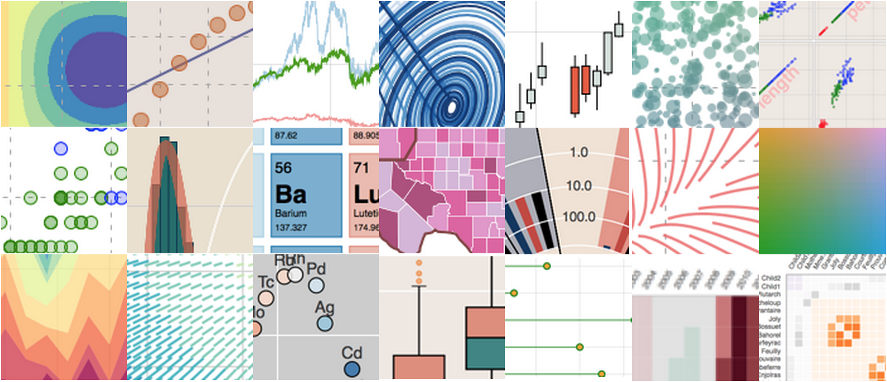

<html><head>
<meta http-equiv="content-type" content="text/html; charset=UTF-8"></head><body>---
title: "**P1** | Basic tools for data visualization"
subtitle: "Introduction"
author: "<b>Marta Coronado Zamora</b>"
date: "27 September 2019"
output:
  xaringan::moon_reader:
    css: ["default", "rutgers", "metropolis-fonts", 
"https://cdnjs.cloudflare.com/ajax/libs/animate.css/3.7.2/animate.min.css",
 "https://use.fontawesome.com/releases/v5.10.1/css/all.css"]
    lib_dir: libs
    nature:
      highlightStyle: github
      highlightLines: true
      countIncrementalSlides: false
      ratio: "16:9"
      
---
```{r setup, include=FALSE}
options(htmltools.dir.version = FALSE)
# Animations: https://github.com/daneden/animate.css#animations
# pagedown::chrome_print("P1_slides.html")
knitr::opts_chunk$set(echo = FALSE, eval = TRUE, fig.width = 4, 
fig.height = 3.5, fig.show = 'hold', message = FALSE)
library(ggplot2)
library(lattice)
```

class: inverse, center, middle, animated, fadeIn

<style>
.title-slide {
  background-image: url(http://campus.bonsoleil.es/wp-content/uploads/2019/02/new-ESCI-UPF.png);
  background-size: 150px;
}
</style>

# Keep in touch
<a href="mailto:marta.coronado@uab.cat"><i class="fa fa-paper-plane fa-fw"></i>&nbsp; marta.coronado@uab.cat</a><br>
<a href="https://twitter.com/geneticament"><i class="fab fa-twitter fa-fw"></i>&nbsp; @geneticament</a><br>
<a href="https://github.com/marta-coronado"><i class="fab fa-github fa-fw"></i>&nbsp; @marta-coronado</a><br>
<a href="https://uab.cat/"><i class="fa fa-map-marker fa-fw"></i>&nbsp; Universitat Autònoma de Barcelona</a>

---
layout: true
class: animated, fadeIn

---
# Course overview

### Theoretical sessions (20h)

**T1** | Introduction (<font color=" #A8A8A8">Guillaume Filion</font>)<br><br>

--
**Part 1: Tools for data visualization** (<font color=" #A8A8A8">Marta Coronado</font>)<br>
**T2.1** | Basic (`ggplot2`) - P1, P2<br>
**T2.2** | For bioinformatics - P3 (first assignment)<br>
**T3** | Dynamic and interactive (`plotly`, `shiny`) - P4, P5 (second assignment)<br><br>

--
**Part 2:  Visualization concepts** (<font color=" #A8A8A8">Guillaume Filion</font>)<br>
**T4** | Exploitation - P6<br>
**T5** | Exploration - P7<br>
**T6** | Advanced - P8


---
# Course overview

### Practical sessions (16h)

**Part 1** | Tools for data visualization (<font color=" #A8A8A8">Marta Coronado</font>)<br>

**Sessions 1-3** | Basic tools for data visualization

**Session 4-5** Interactive visualization

--

**Part 2 ** |  Visualization concepts (<font color=" #A8A8A8">Guillaume Filion</font>)<br>

**Sessions 6** | Principal component analysis

**Sessions 7** | Co-inertia analysis

**Sessions 8** | t-SNE

---

# Evaluation

- **10% active participation**
  + Tools (Marta, 9 sessions) <br>
  Individual submission at the end of each session
  + Concepts (Guillaume, 9 sessions)<br><br>

--
- **40% group assignments** (minimum grade 4/10)
  + 4 assignments, each 10%<br><br>

--
- **50% final exam** (minimum grade 4/10)

---

# Practical session dynamics

**Content** (P1-P5)
- Introduction 
- Exercises - complete and submit to [aul@-ESCI](https://aula.esci.upf.edu/course/view.php?id=5309)
- Project (divided in to 2 assignments)
<br><br>

--

**Interactive <i class="fab fa-r-project fa-fw"></i> documents**  
`R code` can be executed within RStudio!

```{r, echo=TRUE}
value &lt;- 2
value + 3
```

--
Important code will be highlited! <i class="fas fa-smile-wink fa-fw"></i>

```{r, eval=FALSE, echo=TRUE}
if (TRUE) {
{{ message("Very important!") }}
}
```
---
layout: false
class: left, bottom, inverse, animated, bounceInDown

# Get started!
## **Tools for data visualization**

---
layout: true
class: animated, fadeIn

---
# Exercise: show your tools!

1. Download the data in [this](http://goo.gl/DFWCmQ) file and, using any tool you like <font color="#A8A8A8">(e.g.: R, online tools, Microsoft Excel, etc.)</font>, represent the following:
    +  A [scatter plot](https://en.wikipedia.org/wiki/Scatter_plot) of the variables x and y.
    +  A [bar plot](https://en.wikipedia.org/wiki/Bar_chart) of the counts of z.
2. Discuss with your partner the pros and cons of the chosen tool.


---
## Type of tools

### Two main types:

- Graphical user interface (GUI)
  <font color="#A8A8A8">Many examples: Perseus computational platform, Cytoscape, Blast2GO, Gephi, ... </font>
  
- Code-based
  <font color="#A8A8A8">R (and other computer languages)</font>

[Wide range...](https://en.wikipedia.org/wiki/List_of_information_graphics_software)

<br>
--

<div style="background-color:#FFDA9E">
<b><i class="fas fa-question-circle"></i>&nbsp;Question</b>
<br>
What prons and cons do you think GUI tools have in comparison to code-based? 
</div>

---

## Visualization libraries in R

- `base`
- `grid`: `lattice` and `ggplot2`

<center>
```{r, warning = FALSE, echo = FALSE}

# Basic R boxplot
boxplot(Petal.Length ~ Species,
        data = iris,
        ylab = "Petal length",
        col = c("red", "blue", "green"),
        main = "Basic")

# Lattice boxplot
bwplot(
  Petal.Length ~ Species,
  group = Species,
  data = iris,
  main = "Lattice",
  ylab = "Petal length",
  par.settings = list(box.umbrella=list(col = c("red", "green", "blue")),
                      box.dot = list(col = c("red", "green", "blue")),
                      box.rectangle = list(col = c("red", "green", "blue"))))

# ggplot2 boxplot
ggplot(data = iris, mapping = aes(x = Species, y = Petal.Length, fill = Species)) +
  geom_boxplot() +
  ylab("Petal length") +
  ggtitle("ggplot2")
```

<br>
--

<div style="background-color:#FFDA9E" align="left">
<b><i class="fas fa-question-circle"></i>&nbsp;Question</b>
<br>
Describe the graphics. In your opinion, which do you think is the 
simplest? and the most complex? do you think the code to generate the 
figures reflect the complexity?
</div>

---
## Visualization libraries in R

```{r, echo=TRUE, message=FALSE, eval = FALSE}
# base
hist(iris$Sepal.Width)

# ggplot2
ggplot(iris, aes(Sepal.Width)) +
  geom_histogram()
```

<center>
```{r, echo=FALSE, message=FALSE}
# base
hist(iris$Sepal.Width)

# ggplot2
ggplot(iris, aes(Sepal.Width)) +
  geom_histogram()
```

---
## Visualization libraries in R

.pull-left[
```{r, echo = TRUE, eval = FALSE}
# base
plot(circumference ~ age,
     data=Orange[Orange$Tree %in% "4", ], type = "l",
     main = "Base - complex")
points(circumference ~ age, col="darkred",
       data=Orange[Orange$Tree %in% "2", ], type = "l")
points(circumference ~ age, col="orange",
       data=Orange[Orange$Tree %in% "5", ], type = "l")
points(circumference ~ age, col="yellow",
       data=Orange[Orange$Tree %in% "1", ], type = "l")
points(circumference ~ age, col="darkgreen",
       data=Orange[Orange$Tree %in% "3", ], type = "l")
legend("topleft",
       c("4", "2", "5", "1", "3"), title="Tree",
       col=c("black", "darkred", "darkorange", "yellow", "darkgreen"),
       lty=c(1, 1, 1, 1, 1))
```

```{r, echo = TRUE, eval = FALSE}
# ggplot2
ggplot(Orange, aes(age, circumference,
      colour = Tree)) + geom_line() +
      labs(title = "ggplot2 - complex")
```
]

--
.pull-right[
```{r, echo=FALSE, fig.keep='last', fig.width=5, fig.height=3.5, fig.align="center"}
# base
plot(circumference ~ age,
     data=Orange[Orange$Tree %in% "4", ], type = "l",
     main = "Base - complex")
points(circumference ~ age, col="darkred",
       data=Orange[Orange$Tree %in% "2", ], type = "l")
points(circumference ~ age, col="orange",
       data=Orange[Orange$Tree %in% "5", ], type = "l")
points(circumference ~ age, col="yellow",
       data=Orange[Orange$Tree %in% "1", ], type = "l")
points(circumference ~ age, col="darkgreen",
       data=Orange[Orange$Tree %in% "3", ], type = "l")
legend("topleft",
       c("4", "2", "5", "1", "3"), title="Tree",
       col=c("black", "darkred", "darkorange", "yellow", "darkgreen"),
       lty=c(1, 1, 1, 1, 1))
```

```{r, echo=FALSE, fig.width=5, fig.height=2.5, fig.align="center"}
# ggplot2
ggplot(Orange, aes(age, circumference, colour = Tree)) +
  geom_line()+
  labs(title = "ggplot2 - complex")
```
]

---
## Visualization libraries in R

.pull-left[
```{r, echo = TRUE, eval = FALSE}
# base
plot(circumference ~ age,
     data=Orange[Orange$Tree %in% "4", ], type = "l",
     main = "Base - complex")
points(circumference ~ age, col="darkred",
       data=Orange[Orange$Tree %in% "2", ], type = "l")
points(circumference ~ age, col="orange",
       data=Orange[Orange$Tree %in% "5", ], type = "l")
points(circumference ~ age, col="yellow",
       data=Orange[Orange$Tree %in% "1", ], type = "l")
points(circumference ~ age, col="darkgreen",
       data=Orange[Orange$Tree %in% "3", ], type = "l")
legend("topleft",
       c("4", "2", "5", "1", "3"), title="Tree",
       col=c("black", "darkred", "darkorange", "yellow", "darkgreen"),
       lty=c(1, 1, 1, 1, 1))
```

```{r, echo = TRUE, eval = FALSE}
# ggplot2
ggplot(Orange, aes(age, circumference,
      colour = Tree)) + geom_line() +
      labs(title = "ggplot2 - complex")
```
]

.pull-right[
<center>


]

---
### Other visualization libraries

(Outside our scope)

- Python
    + `matplotlib`, `seaborn`
    + `Bokeh`, `pygal`
- Java: `Processing`
- Javascript: `D3.js`

<center>

</center>

---
layout: false
class: left, bottom, inverse, animated, bounceInDown

# Basic R knowledge

---
layout: true
class: animated, fadeIn

---
### Installing a package

```{r, eval = FALSE, echo = TRUE}
# Download and install a package from CRAN
install.packages("ggplot2")

# Download and install a package from GitHub (you need the devtools library installed)
devtools::install_github("yihui/xaringan")
```

### Loading a package

```{r, eval = FALSE, echo = TRUE}
# Load the library to the current session
library("ggplot2")
library("xaringan")
```

### Loading data

```{r, eval = FALSE, echo = TRUE}
# Loading a tab-separated file with a header
data &lt;- read.table("data.txt", header = TRUE, sep = "\t")
```

---
## Data types and structures

Main data types <font color=" #A8A8A8">(other will not be discussed: _complex_ and _raw_)</font>:

- __Logical__: can only take on two values: true (`TRUE`, `T`) or false (`FALSE`, `F`)
- __Numeric__: real or decimal (`2`, `15.5`)
- __Integer__: `2L` (the `L` tells R to store this as an integer)
- __Character__: any type of character or number (`"a"`, `"swc"`, `"2"`)

--

<i class="fas fa-info-circle"></i> To know the data type, you can use the `class()` function.


```{r, echo = TRUE}
type_list &lt;- list(TRUE, 1.2, 10L, "a")
sapply(type_list, class)
```

---
## Data types and structures

Elements of the previous data types may be combined to form data structures. Main structures:

- __Vector__: collection of elements that holds data of a single data type
- __Matrix__: vector with dimensions (the number of rows and columns)
- __Factor__: to deal with categorical variables
- __List__: a special type of vector where each element can be a different type
- __Data Frame__ <i class="fas fa-star"></i>: a special type of list where every element of the list has same length 

--
```{r, echo = TRUE}
# A vector x of mode numeric
x &lt;- c(1, 2, 3)

# A vector y of mode logical
y &lt;- c(TRUE, TRUE, FALSE, FALSE)

# A vector z of mode character
z &lt;- c("Sarah", "Tracy", "Jon")
```

---
## Data types and structures

Elements of the previous data types may be combined to form data structures. Main structures:

- __Vector__: collection of elements that holds data of a single data type
- __Matrix__: vector with dimensions (the number of rows and columns)
- __Factor__: to deal with categorical variables
- __List__: a special type of vector where each element can be a different type
- __Data Frame__ <i class="fas fa-star"></i>: a special type of list where every element of the list has same length 

```{r, echo = TRUE}
matrix22 &lt;- matrix(
  c(1, 2, 3, 4),
  nrow = 2,
  ncol = 2)
matrix22
```

---
## Data types and structures

Elements of the previous data types may be combined to form data structures. Main structures:

- __Vector__: collection of elements that holds data of a single data type
- __Matrix__: vector with dimensions (the number of rows and columns)
- __Factor__: to deal with categorical variables
- __List__: a special type of vector where each element can be a different type
- __Data Frame__ <i class="fas fa-star"></i>: a special type of list where every element of the list has same length 

```{r, echo = TRUE}
factor_vector &lt;- as.factor(c("rna", "dna", "dna", "rna"))
factor_vector
str(factor_vector)
```

---
## Data types and structures

Elements of the previous data types may be combined to form data structures. Main structures:

- __Vector__: collection of elements that holds data of a single data type
- __Matrix__: vector with dimensions (the number of rows and columns)
- __Factor__: to deal with categorical variables
- __List__: a special type of vector where each element can be a different type
- __Data Frame__ <i class="fas fa-star"></i>: a special type of list where every element of the list has same length 

```{r, echo = TRUE}
x &lt;- list(1, "a", TRUE, 1+4i)
x
```

---
## Data types and structures

Elements of the previous data types may be combined to form data structures. Main structures:

- __Vector__: collection of elements that holds data of a single data type
- __Matrix__: vector with dimensions (the number of rows and columns)
- __Factor__: to deal with categorical variables
- __List__: a special type of vector where each element can be a different type
- __Data Frame__ <i class="fas fa-star"></i>: a special type of list where every element of the list has same length 

```{r, echo = TRUE}
dat &lt;- data.frame(id = letters[1:10], x = 1:10, y = 11:20)
dat
```
---


## Tidy data

Data frames with one observation per row and one variable per column.

```{r, eval = TRUE}
not_tidy &lt;- data.frame(
    maker = c("Delorian", "Fantom"),
    cyl = c(4, 2),
    hp = c(160, 80),
    carb = c(4, 2)
)
tidy &lt;- data.frame(
    maker = rep(c("Delorian", "Fantom"), times = 3),
    metric = rep(c("cyl", "hp", "carb"), each = 2),
    value = c(4, 160, 4, 2, 80, 2)
)
```

```{r, eval = TRUE, echo = TRUE}
not_tidy
tidy
```

---
## Tidy data

There are useful `packages::functions` to change from wide to long format:

```{r eval = FALSE, echo = TRUE}
reshape2::melt(
    not_tidy,
    id.vars= "maker",
    variable.name = "metric",
    value.name = "score"
    )

tidyr::gather(
    not_tidy,
    - maker,
    key = "metric",
    value = "score"
    )
```

---
# Getting help <i class="fas fa-question-circle"></i>

- `?read.table`, `?str`, `?as.factor`
- Press F1 (in RStudio)
- [Stack Overflow](https://stackoverflow.com) 
([`R`](https://stackoverflow.com/questions/tagged/r), 
[`ggplot2`](https://stackoverflow.com/questions/tagged/ggplot2))
- Ask your classmates or your teacher

---

# Exercise: describe a data set

Read the file in this [link](https://goo.gl/c9szmq), ensure it has a 
tidy and long format and indicate the data type of each variable.

---

# Practice <i class="fas fa-cogs"></i>
## Introduction to `ggplot2`

- Open the document `P1_exercises.Rmd` in RStudio and complete the exercises.
- Upload the completed document to [Aul@-ESCI](https://aula.esci.upf.edu/course/view.php?id=5309) at the end of the session.

---

# Project

## Group project

The project has 3 differents parts (A, B and C) divided in two big assignments.
- You will deliver the 3 parts separately to get feedback before submitting the final version
- Each part must be submitted before next practical session
- The first assignment will contain parts A and B
- The second assignment will contain part C
- ~15 minutes in the end of each class devoted to discuss your problems

**Final assignment dates:**
- Parts A and B: 18 october
- Part C: 1 november

---
# Project

## Group project

__Part A__

- __1\.__ Create groups of \~4 people
- __2\.__ Choose a data set with the following requirements
    + Tabular format (txt, csv, tsv...)
    + More than 80 observations
    + At least 6 variables
    + At least 2 discrete and 3 continuous variables
    + Data with biological meaning
    + Different from the ones chosen by other groups

---
# Project

## Group project

- __3\.__ Describe your data set:
    + Where and why was the information collected?
    + Which is the meaning of each variable?
    + Do the variables have unit? Which one?
    + Does the data set have a long format?
- __4\.__ Write the code to:
    + Read it into R
    + Reshape the data if necessary into long format
    + Check the variable classes and update them if necessary

Write 3 and 4 in an `R Markdown` document and __submit it before next practical session__ (one per group).

<i class="fas fa-info-circle"></i> If you need help formatting the R 
Markdown, check the R Markdown cheatsheet available in 
[Aul@-ESCI](https://aula.esci.upf.edu/course/view.php?id=5309) or ask 
me.

---

## Data sets from research articles

- ["Whole-genome landscapes of major melanoma 
subtypes"](https://www.nature.com/articles/nature22071#supplementary-information)
 (e.g., Table S1)
- ["Zika virus evolution and spread in the 
Americas"](https://www.nature.com/articles/nature22402#supplementary-information)
 (Table S2)
- ["Great ape genetic diversity and population 
history"](https://www.nature.com/articles/nature12228#supplementary-information)
 (Table S1 or S3)
- ["Transcriptome and genome sequencing uncovers functional variation in
 humans"](https://www.nature.com/articles/nature12531). [Table with cis 
eQTLs in 
EUR](https://www.ebi.ac.uk/arrayexpress/files/E-GEUV-1/EUR373.gene.cis.FDR5.best.rs137.txt.gz)
 
([description](https://www.ebi.ac.uk/arrayexpress/files/E-GEUV-1/GeuvadisRNASeqAnalysisFiles_README.txt))
-
 ["Signatures of Archaic Adaptive Introgression in Present-Day Human 
Populations"](https://academic.oup.com/mbe/article/34/2/296/2633371#supplementary-data)
 (Table S3)
- ["The evolutionary history of dogs in the 
Americas"](http://science.sciencemag.org/content/361/6397/81) (Table S1)
- ["Ancient genomes document multiple waves of migration in Southeast 
Asian prehistory"](http://science.sciencemag.org/content/361/6397/92) 
(Table S1)
</center></center></center></body></html>